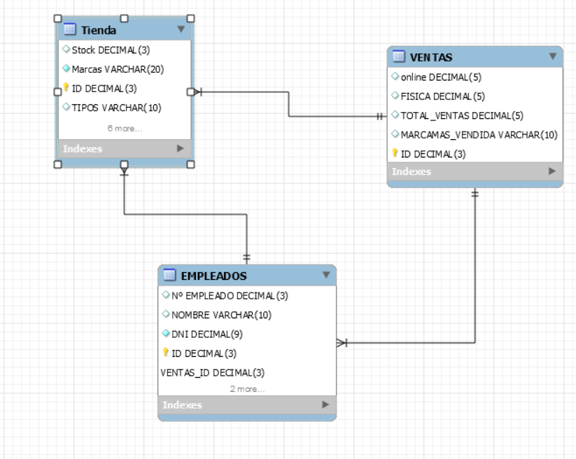

# ZapatosELJust
En esta pagina web vamos a ver al completo todas las características de las que dispone nuestra tienda online.
## 1.Introducció
* **Nombre de la tienda**: ZapatosELJust
* **Objectivos**: 
  * Enseñar todas las caracteristicas que dispone nuestra tienda online.
* **Descripción**: En esta pagina web vamos a ver al completo todas las características de las que dispone nuestra tienda online.
* **Desenvolupador**: @daniabad
* **Direccion web en github**: https://github.com/daniabad/ZapatosELJust.git

### 2.Diseño
La aplicacion dispondra de tres tablas, para controlar ya sea las ventas en tienda fisica como online y contendra una tabla de empleados para controlar quien hace cada venta.

#### 2.1 Descripccion de la base de datos
Este es el esquema que vamos a utilizar para adminitras nuestra web

#### 2.2 Descripcion de la web
La pagina web tendra este aspecto:
